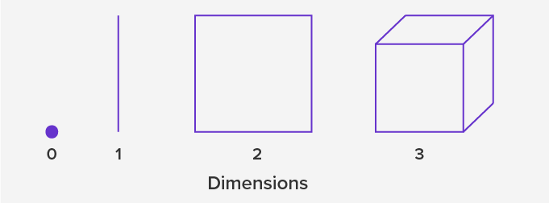

Tags: #Topic

# Dimensions

A dimension represents a type of space.

## 0th Dimension (0D)

A space consisting of only a point.

- Everything must exist at that point.
- Objects have no length, width, or height.

	> **Ex.**
	> Points are the only 0D objects.

#### Position
No values is required to determine the position of a 0D object.

## 1st Dimension (1D)

A space consisting of only an inflinitely long line. 

- Objects have a length.
- Everything must exist on that line. 

	> **Ex.**
	> A number line is an example of one-dimensional space.
	>  
	> Lines and points are the only 1D objects.

#### Position
One values is required to determine the position of a 1D object.

$$\huge (x)$$

## 2nd Dimension (2D)

A space consisting of an infinitely large plane.

- Objects have a length and width.
- Everything must exist on that plane.

	> **Ex.**
	> A coordinate plane is an exampel of a two-dimensional space.
	> 
	> Circles, squares, rectangles, and triangles would be examples of 2D objects.

#### Position
Two values are required to determine the position of a 2D object.

$$\huge (x, y)$$

## 3rd Dimension (3D)

A space that we as humans live in.

- Objects have a length, width, and height.

	> **Ex.**
	> Cubes, pyramids, cylinders, and spheres would be examples of 3D objects.

#### Position
Three values are required to determine the position of a 3D object.

$$\huge (x, y, z)$$